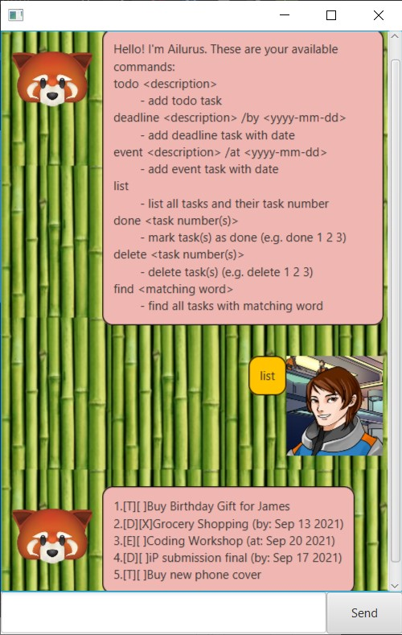

# User Guide for Ailurus



## Features 

### Add, delete and list tasks

You are able to add, delete and list all the task you have
added. There are 3 types of tasks you can add:

* **todo**: tasks with no parameters.
* **deadline**: tasks with deadline
* **event**: tasks that are at a specific date

### Mark tasks as done

You can mark tasks as done and an `X` will be placed beside
the task.

### Find task

You can search for the task you need with the `find` keyword.

## Usage

### `todo` - Add todo task

Add a task with no parameters.

Example of usage: 

`todo Buy Birthday Gift for James`

Expected outcome:

Adds `Buy Birthday Gift for James` to task list.
Tells you how many tasks in the list after the addition.

```
Got it. I've added this task:
    [T][ ]Buy Birthday Gift for James
Now you have 1 tasks in the list
```

### `deadline` - Add deadline task

Add a task with deadline date.

Example of usage:

`deadline Grocery Shopping /by 2021-09-13`

Expected outcome:

Adds `Grocery Shopping` to task list with date `Sep 13 2021`.
Tells you how many tasks in the list after the addition.

```
Got it. I've added this task:
    [D][X]Grocery Shopping (by: Sep 13 2021)
Now you have 2 tasks in the list
```

### `event` - Add event task

Add a task with deadline date.

Example of usage:

`event Coding Workshop /at 2021-09-20`

Expected outcome:

Adds `Coding Workshop` to task list with date `Sep 20 2021`.
Tells you how many tasks in the list after the addition.

```
Got it. I've added this task:
    [E][ ]Coding Workshop (at: Sep 20 2021)
Now you have 3 tasks in the list
```

### `list` - lists all tasks

Lists all tasks in database, unless there is none.
Loads tasks from `data/tasks` file if not empty.

Example of usage:

`list`

Expected outcome:

Returns a list of all tasks in task list.

```
1.[T][ ]Buy Birthday Gift for James
2.[D][ ]Grocery Shopping (by: Sep 13 2021)
3.[E][ ]Coding Workshop (at: Sep 20 2021)
```

### `done` - mark as done

Mark task(s) as done by marking an `X` beside it.
Specify the task number(s) you wish to mark as done.

Example of usage:

`done 2 3`

Expected outcome:

Marks task 2 and task 3 as done

```
Nice! I've marked this task as done:
    [D][X]Grocery Shopping (by: Sep 13 2021)
    [E][X]Coding Workshop (at: Sep 20 2021)
```

### `delete` - delete task(s)

Delete task(s) permanently. Specify the task number(s)
you wish to delete.

Example of usage:

`delete 2 3`

Expected outcome:

Deletes task 2 and task 3, and tells how many tasks you
have left in the list

```
Noted. I've removed this task:
    [D][X]Grocery Shopping (by: Sep 13 2021)
    [E][X]Coding Workshop (at: Sep 20 2021)
    
Now you have 1 tasks in the list.
```

### `find` - find task(s)

Find tasks that match keyword. Not case-sensitive.

Example of usage:

`find buy`

Expected outcome:

Returns the tasks that match the keyword.

```
Here are the matching tasks in your list:
1.[T][ ]Buy Birthday Gift for James
```

### `bye` - exit program

Exit program

Example of usage:

`bye`

Expected outcome:

Says goodbye and close program.

```
Bye. Hope to see you again soon!
```